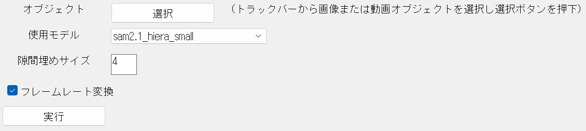

## AviUtl2 Remove Background
AIが動画の背景を取り除きます

画像の背景も取り除きます

https://github.com/user-attachments/assets/e1182ad0-f3a3-4713-9e75-b1c585587e71

hiera_base_plulsの場合

RTX3050 Laptop (4GB)：約200フレーム/分

Ryzen5 5600H：約10フレーム/分

## インストール
1. [python3.13](https://www.python.org/downloads/windows/)、をインストールし、CUDAを使用する場合はCUDA13.0以上に対応した[GeForceドライバ](https://www.nvidia.com/ja-jp/geforce/drivers/)もインストールする

   ※Pythonをインストールする際は、「Add python.exe to PATH」にチェックを入れて下さい

2. installer.exeを実行してインストール

   ※「スマートアプリコントロールが安全でない可能性のあるアプリをブロックしました」と出る場合は、Windowsセキュリティで「アプリとブラウザー コントロール」->「スマートアプリコントロールの設定」からオフにすると実行できます（自己責任）

3. AviUtl2を開き、上のバーから「表示」=>「AviUtl2 Remove Background」を選択

## アップデート
最新版をダウンロードしてinstaller.exeを実行

## ダウンロード
https://github.com/arajun94/AviUtl2_Remove_Background/releases/latest

cpuを使用する場合はarbx.x.zip

cudaを使用する場合はarbx.x_cuda.zip

## 設定項目説明

|  |  |
|---|---|
| オブジェクト | タイムラインからオブジェクトを選択する |
| 使用モデル | large > base_plus > small > tiny の順で精度が良く、精度が良いほど遅い |
| 隙間埋めサイズ | クロージング処理のカーネルサイズ |
| フレームレート変換 | ソース動画のフレームレートをプロジェクトのフレームレートに変換してから処理する|

フレームレート変換を行えば多くの場合マスクのズレが解消される。さらにフレームを間引く場合には推論の高速化が見込まれる

ただし、余計なファイルが増えること、変換に時間がかかることに注意

## ライセンス
MITライセンス